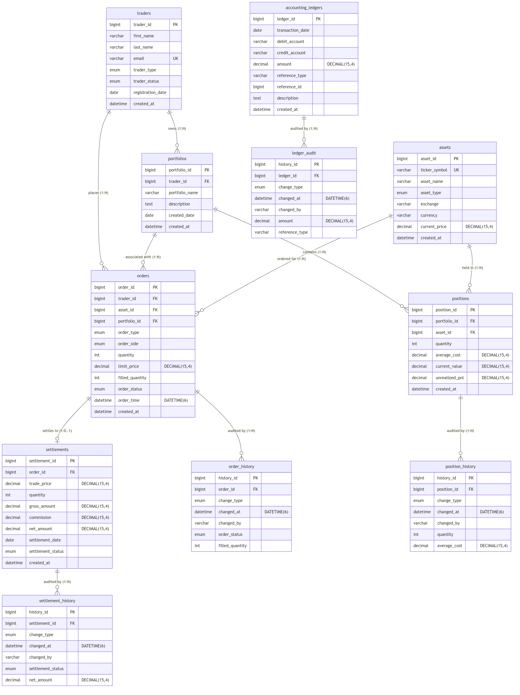

# Capital Markets Trading Platform

> 📊 MySQL 数据库课程设计项目 — 资本市场交易平台数据库系统

A full-stack capital markets trading platform built as an undergraduate database course project. Features a normalized MySQL 8.4 database with Flyway migrations, a Spring Boot REST API, and a Vue.js 3 frontend.



## ✨ Features

- **Database**: 11 tables (7 core + 4 audit history), fully normalized to 3NF
- **Flyway Migrations**: 5 versioned SQL scripts for reproducible schema deployment
- **Stored Procedures**: Financial transaction handling with row-level locking (`SELECT ... FOR UPDATE`)
- **Audit Logging**: Automatic history tracking via `AFTER UPDATE/DELETE` triggers
- **Double-Entry Accounting**: Append-only ledger with balanced debit/credit journal entries
- **Data Generation**: Python Faker scripts generating 10K traders, 100K+ orders
- **REST API**: Spring Boot 3.4 with 3 order management endpoints
- **Frontend**: Vue.js 3 + Pinia + Vite for order CRUD operations
- **Security**: Role-based MySQL GRANT access control

## 🏗️ Tech Stack

| Layer      | Technology              | Version   |
|------------|-------------------------|-----------|
| Database   | MySQL (InnoDB)          | 8.4       |
| Migrations | Flyway                  | —         |
| Backend    | Spring Boot + JPA       | 3.4.3     |
| Frontend   | Vue.js 3 + Pinia + Vite | 3.x / 5.x|
| Testing    | pytest                  | —         |
| Data Gen   | Python Faker            | —         |

## 📁 Project Structure

```
capital-markets-db/
├── migrations/             # Flyway SQL migration scripts (V1–V5)
├── backend/                # Spring Boot REST API
│   └── src/main/java/com/trading/
├── frontend/               # Vue.js 3 + Pinia frontend
│   └── src/
├── data_generation/        # Python data generation scripts
├── tests/                  # pytest stored procedure tests
├── security/               # MySQL GRANT statements
├── scripts/                # Utility scripts
├── docs/                   # Design documentation
│   ├── screenshots/        # UI & diagram screenshots
│   └── output/             # Command output logs
└── .env.example            # Environment variable template
```

## 🚀 Quick Start

### Prerequisites

- MySQL 8.4+
- Java 23 (OpenJDK)
- Node.js 24+ / npm 11+
- Python 3.12+

### 1. Database Setup

```bash
# Create the database
mysql -u root -p -e "CREATE DATABASE IF NOT EXISTS capital_markets_db CHARACTER SET utf8mb4 COLLATE utf8mb4_unicode_ci;"

# Apply migrations in order
mysql -u root -p capital_markets_db < migrations/V1__Create_Core_Tables.sql
mysql -u root -p capital_markets_db < migrations/V2__Add_Indexes_And_Views.sql
mysql -u root -p capital_markets_db < migrations/V3__Add_Stored_Procedures.sql
mysql -u root -p capital_markets_db < migrations/V4__Add_Audit_Triggers.sql
mysql -u root -p capital_markets_db < migrations/V5__Seed_Reference_Data.sql
```

### 2. Environment Variables

```bash
# Copy and edit the environment template
cp .env.example .env
# Edit .env with your MySQL credentials
```

### 3. Generate Test Data

```bash
pip install -r data_generation/requirements.txt

# Set environment variables, then run:
export MYSQL_PASSWORD=your_password
python data_generation/generate_data.py
```

### 4. Start Backend

```bash
cd backend

# Windows
set MYSQL_PASSWORD=your_password
mvnw.cmd spring-boot:run

# Linux/macOS
export MYSQL_PASSWORD=your_password
./mvnw spring-boot:run
```

The API will be available at `http://localhost:8080`.

### 5. Start Frontend

```bash
cd frontend
npm install
npm run dev
```

The frontend will be available at `http://localhost:5173`.

## 🗄️ Database Schema

### Core Tables

| Table                 | Description              |
|-----------------------|--------------------------|
| `traders`             | Trader accounts (Individual / Institutional) |
| `assets`              | Financial instruments (stocks, bonds, etc.)   |
| `portfolios`          | Trader portfolio groupings                    |
| `orders`              | Trading orders with status tracking           |
| `positions`           | Current holdings per portfolio                |
| `settlements`         | Trade settlement records                      |
| `accounting_ledgers`  | Double-entry accounting journal               |

### Audit History Tables

| Table                       | Tracks changes to |
|-----------------------------|-------------------|
| `order_history`             | `orders`          |
| `position_history`          | `positions`       |
| `settlement_history`        | `settlements`     |
| `accounting_ledger_history` | `accounting_ledgers` |

## 🧪 Testing

```bash
# Run stored procedure tests
export MYSQL_PASSWORD=your_password
pytest tests/ -v
```

Tests cover:
- Valid order cancellation with refund
- Double-cancellation prevention
- Cross-trader authorization check
- Concurrent cancellation locking (SELECT...FOR UPDATE)
- Rollback on nonexistent orders

## 📄 Documentation

Detailed design documents are in the `docs/` directory:

- [Requirements Specification](docs/01-requirements.md)
- [ER Diagram](docs/02-er-diagram.md)
- [Normalization Analysis (3NF)](docs/03-normalization.md)
- [Logical Design](docs/04-logical-design.md)
- [Security Design](docs/05-security-design.md)

## 📜 License

This project is licensed under the [MIT License](LICENSE).
