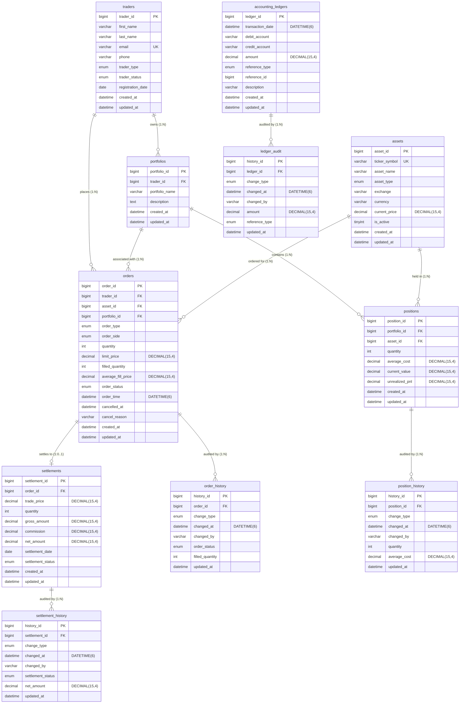

# Stage 2: Entity-Relationship Diagram — Capital Markets Trading Platform

---

## 2.1 Entity-Relationship Diagram

---

## 2.2 Relationship Narrative

**Core One-to-Many Relationships.** A trader may own many portfolios, each
representing a distinct investment mandate; every portfolio belongs to exactly
one trader. Traders may place many orders over their lifecycle; each order is
attributed to its single submitting trader. Portfolios contain many positions —
one per asset, uniquely constrained on `(portfolio_id, asset_id)` — and are
referenced by many orders, routing execution updates to the correct holdings
set. Assets appear across many positions and many orders; each position and
order references exactly one asset. All 1:N relationships are enforced by
foreign key constraints with `ON DELETE RESTRICT`, preventing removal of parent
rows still referenced by child records.

**Optional One-to-Zero-or-One: orders → settlements.** A settlement record is
created only upon order execution (`FILLED` or `PARTIALLY_FILLED` state); orders in
status `PENDING` or `CANCELLED` carry no associated settlement record. The
cardinality notation `||--o|` expresses this precisely: every settlement has
exactly one parent order (mandatory left side), but an order may have zero or
one settlement record (optional right side). This faithfully models the T+2
workflow, where settlement obligations arise only after execution, not at order
submission.

**Polymorphic Reference in accounting_ledgers.** The `reference_type` (VARCHAR)
and `reference_id` (BIGINT) columns together implement a polymorphic association
pattern: `reference_type = 'ORDER'` links the entry to `orders.order_id`;
`reference_type = 'SETTLEMENT'` links it to `settlements.settlement_id`;
`reference_type = 'ADJUSTMENT'` captures manual corrections outside the
automated workflow. Because the referenced entity type varies at runtime, no
database-level foreign key constraint can be declared for this column pair —
referential integrity is enforced within stored procedure logic instead. This
design eliminates multiple nullable FK columns and keeps the ledger extensible
for future event types without schema alteration.

**Trigger-Based, INSERT-Only Audit Tables.** The four history tables are
populated exclusively by `AFTER UPDATE` and `AFTER DELETE` database triggers on
their respective parent tables (FR-AUD-001, FR-AUD-002). Enforcing audit capture
at the InnoDB engine level ensures every modification is recorded regardless of
whether it originates from the application layer, a stored procedure, or a
direct administrative session — sources that application-level logging cannot
guarantee to intercept. No database role is granted `UPDATE` or `DELETE`
privileges on any history table (FR-AUD-003), rendering each audit row immutable
from the moment of insertion and producing a tamper-evident, append-only journal
that meets compliance and evidentiary audit requirements.
